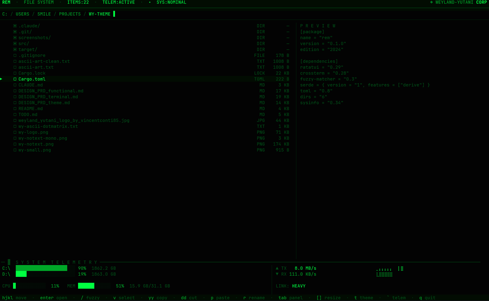
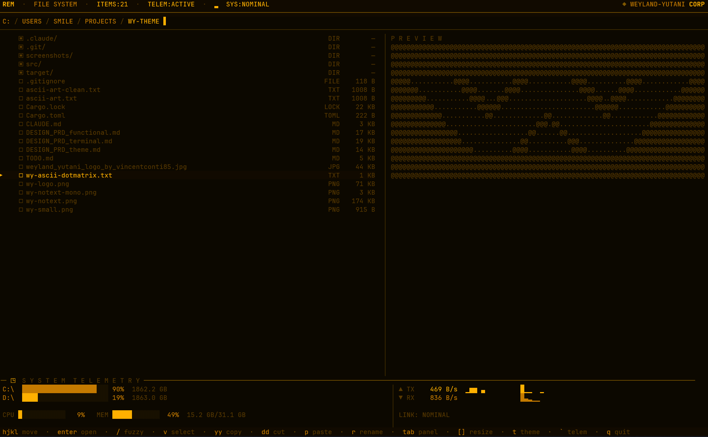
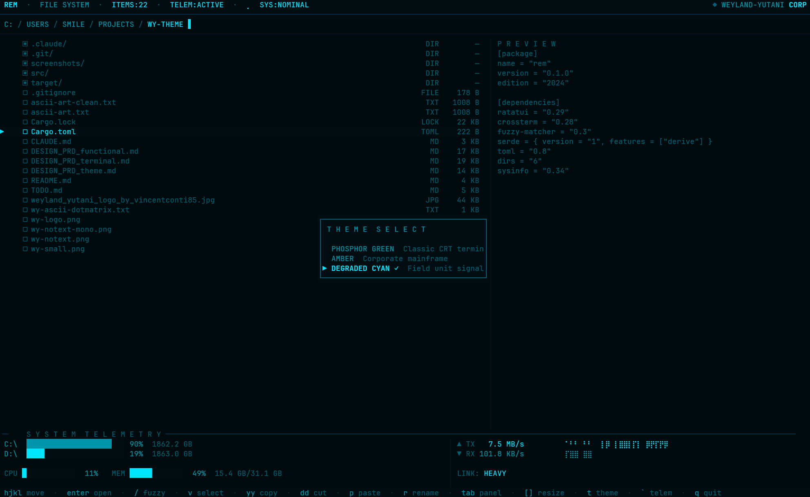

# rem

A terminal file navigator with a Weyland-Yutani corporate aesthetic. Built in Rust with [ratatui](https://ratatui.rs).

```
@@@@@@@@@@@@@@@@@@@@@@@@@@@@@@@@@@@@@@@@@@@@@@@@@@@@@@@@@@@@@@@@@@@@@@@@@@@@@@@@
@@@@@...........@@@@...........@@@@..........@@@@...........@@@@...........@@@@@
@@@@@@@...........@@@@.......@@@@..............@@@@.......@@@@...........@@@@@@@
@@@@@@@@@...........@@@@...@@@@..................@@@@...@@@@...........@@@@@@@@@
@@@@@@@@@@@...........@@@@@@........................@@@@@@...........@@@@@@@@@@@
@@@@@@@@@@@@@...........@@.............@@.............@@...........@@@@@@@@@@@@@
@@@@@@@@@@@@@@.......................@@..@@.......................@@@@@@@@@@@@@@
@@@@@@@@@@@@@@@@@..................@@......@@..................@@@@@@@@@@@@@@@@@
@@@@@@@@@@@@@@@@@@..............@@@..........@@@..............@@@@@@@@@@@@@@@@@@
@@@@@@@@@@@@@@@@@@@@@..........@@@@..........@@@@..........@@@@@@@@@@@@@@@@@@@@@
@@@@@@@@@@@@@@@@@@@@@@@@@@@@@@@@@@@@@@@@@@@@@@@@@@@@@@@@@@@@@@@@@@@@@@@@@@@@@@@@
              W E Y L A N D - Y U T A N I  C O R P O R A T I O N
                       BUILDING  BETTER  WORLDS
```

## Screenshots


### Phosphor Green


### Amber


### Degraded Cyan (with theme picker)


## Features

- **Vim-style navigation** -- `hjkl` movement, `gg`/`G` jump to top/bottom, `/` fuzzy search
- **Dual-pane mode** -- `Tab` to toggle, navigate two directories side by side
- **Visual selection** -- `v` to enter visual mode, bulk select with `j`/`k`
- **File operations** -- `yy` copy, `dd` cut, `p` paste, `D` delete (with confirmation)
- **Fuzzy search** -- `/` to filter the current directory with fuzzy matching
- **Jump keys** -- `f` to show single-key jump labels on each entry
- **Bookmarks** -- `m` + key to set, `'` + key to jump
- **File preview** -- side panel with scrollable file contents
- **Rename & create** -- `r` to rename, `a` to create file, `A` to create directory
- **System telemetry** -- `` ` `` to toggle CPU, RAM, disk, and network stats
- **Theme picker** -- `t` to open, choose between three CRT-inspired palettes
- **Resizable sidebar** -- `[` / `]` to shrink/grow the preview panel
- **Boot sequence** -- animated Weyland-Yutani corporate splash screen

## Themes

| Theme | Description |
|-------|-------------|
| **Phosphor Green** | Classic CRT terminal |
| **Amber** | Corporate mainframe |
| **Degraded Cyan** | Field unit signal |

## Keybindings

### Navigation
| Key | Action |
|-----|--------|
| `h` / `Left` | Go to parent directory |
| `l` / `Right` / `Enter` | Open directory |
| `j` / `Down` | Move cursor down |
| `k` / `Up` | Move cursor up |
| `gg` | Jump to first entry |
| `G` | Jump to last entry |
| `H` | Navigate back in history |
| `L` | Navigate forward in history |
| `-` | Go to parent directory |

### Search & Jump
| Key | Action |
|-----|--------|
| `/` | Fuzzy search current directory |
| `f` | Show jump key labels |
| `m` + key | Set bookmark |
| `'` + key | Jump to bookmark |

### File Operations
| Key | Action |
|-----|--------|
| `yy` | Copy (yank) current file or selection |
| `dd` | Cut current file or selection |
| `p` | Paste from buffer |
| `D` | Delete selection (with confirmation) |
| `r` | Rename current file |
| `a` | Create new file |
| `A` | Create new directory |

### Selection
| Key | Action |
|-----|--------|
| `v` | Toggle visual selection mode |
| `u` | Clear all marks |

### Panels & Display
| Key | Action |
|-----|--------|
| `Tab` | Toggle dual-pane / switch active pane |
| `i` | Cycle right panel (info / preview / hidden) |
| `[` | Shrink sidebar |
| `]` | Grow sidebar |
| `t` | Open theme picker |
| `` ` `` | Toggle telemetry panel |
| `.` | Toggle hidden files |

### General
| Key | Action |
|-----|--------|
| `q` | Quit |
| `Esc` | Cancel current mode |

## Install

```sh
cargo install --path .
```

## Build from source

```sh
git clone https://github.com/johnsideserf/rem.git
cd rem
cargo build --release
./target/release/rem
```

## Requirements

- Rust 2024 edition (1.85+)
- A terminal with Unicode support
- Recommended: a [Nerd Font](https://www.nerdfonts.com/) for best glyph rendering

## License

MIT
